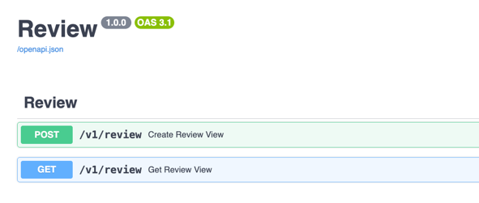

📦 Установка и запуск проекта
🔁 Клонируй репозиторий

```bash
git https://github.com/Hovo-93/analyzer.git
cd your-repo
```
Миграции применяются автоматически

⚙️ Создай .env файл в app/.env
```dotenv
POSTGRES_USER=postgres
POSTGRES_PASS=BlAnterAST
POSTGRES_HOST=db
POSTGRES_PORT=5432
POSTGRES_NAME=analyzer
```
🛠 Собери и запусти проект

```dockerfile
docker compose up --build
```

🌐 Открой в браузере

Swagger UI: http://localhost:8000/docs





Stack: Python,Pydantic,Sqlalchemy,FastAPI
